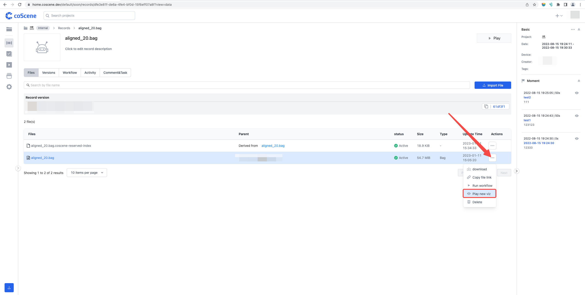
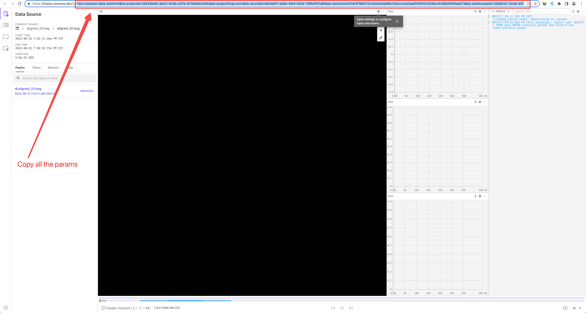
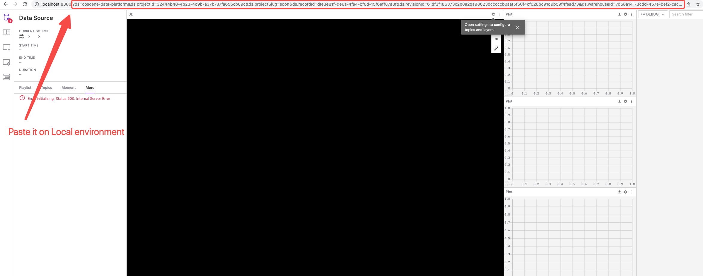

# Honeybee

Honeybee is an integrated visualization and diagnosis tool for robotics, available in browser or as a desktop app on Linux, Windows, and macOS.

**Supported development environments:** Linux, Windows, macOS

**Dependencies:**

- [Node.js](https://nodejs.org/en/) v16.10+
- [Git LFS](https://git-lfs.github.com/)
- [Visual Studio Code](https://code.visualstudio.com/) – Recommended

## Initialization

> Note: Make sure that all the dependencies are set (specially the [Git LFS](https://git-lfs.github.com/)).

1. Clone repository.
2. Run the follow commands: `corepack enable` and `yarn install`.
3. Launch the development environment:

   ```sh
   # To launch the desktop app (run both scripts concurrently):
   $ yarn desktop:serve        # start webpack
   $ yarn desktop:start        # launch electron

   # To launch the browser app:
   $ yarn web:serve

   # To launch the browser app using a local instance of the backend server:
   $ yarn web:serve:local

   # To launch the storybook:
   $ yarn storybook

   # Advanced usage: running webpack and electron on different computers (or VMs) on the same network
   $ yarn desktop:serve --host 192.168.xxx.yyy         # the address where electron can reach the webpack dev server
   $ yarn dlx electron@13.0.0-beta.13 .webpack # launch the version of electron for the current computer's platform

   # To launch the desktop app using production API endpoints
   $ yarn desktop:serve --env FOXGLOVE_BACKEND=production
   $ yarn desktop:start

   # NOTE: yarn web:serve does not support connecting to the production endpoints
   ```

A [Dockerfile](/Dockerfile) to self-host the browser app is also available.

**Other useful commands:**

    ```sh
    $ yarn run          # list available commands
    $ yarn lint         # lint all files
    $ yarn test         # run all tests
    $ yarn test:watch   # run tests on changed files
    ```

## Setup

### (1) Token setup

After opening it on the local browser, we need to set tokens to obtain access authorization. You can choose to set up Bearer token or Basic token.

#### (1.1) Bearer Token

> Note: If you choose to set the Bearer token, you need to set it every day (expire every day).

1. Go to [CoScene Development Page](https://home.coscene.dev/) and Sign In.
2. Open "Chrome Inspector", go to "Application" tab, search for "Local Storage", and copy the following two keys to the local development environment.
   - coScene_org_jwt
   - CoSceneContext

  

#### (1.2) Basic Token

1. Go to [CoScene Development Page](https://home.coscene.dev/) and Sign In.
2. Go to "Setting" and choose the "Security" tab.
3. Click on Generate Access Token, give it a name and expiration time.
4. With token, you need to encode with [base64](https://www.base64encoder.io/) by adding "_apikey:_" to the beginning of the token, e.g.: `apikey:{ACCESS_TOKEN}`.
5. Replace the "coScene_org_jwt" key with: `Basic {ENCODED_TOKEN}`


### (2) Data Source Simulation

To open a data source file, you need to copy the link query of the record on the [CoScene Development Page](https://home.coscene.dev/) and paste it into the local environment, you can follow the pictures below.






## Self-hosting

Honeybee can be run as a standalone [desktop application](https://foxglove.dev/download), accessed in your browser at [studio.foxglove.dev](https://studio.foxglove.dev/), or self-hosted on your own domain.

A Docker image is provided to make self-hosting easy. You can run it like so:

```sh
docker run --rm -p "8080:8080" ghcr.io/foxglove/studio:latest
```

Honeybee will then be accessible in your browser at [localhost:8080](http://localhost:8080/).

For all list of available image versions, see the [package details](https://github.com/foxglove/studio/pkgs/container/studio).

## Credits

Honeybee originally began as a fork of [Foxglove Studio](https://github.com/foxglove/studio), an open source project developed by [Foxglove](https://foxglove.dev/about).

<!-- The codebase has since changed significantly, with a port to TypeScript, more [panels](https://foxglove.dev/docs/panels/introduction), additional [data sources](https://foxglove.dev/docs/connection/data-sources), improved [layout management](https://foxglove.dev/docs/layouts), new [team features](https://foxglove.dev/blog/announcing-foxglove-for-teams), and an [Extension API](https://foxglove.dev/docs/extensions/getting-started). -->
