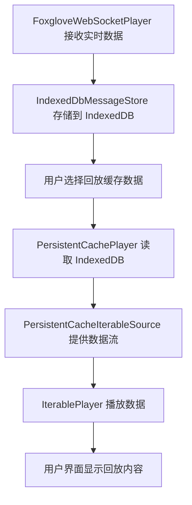

# 持久化缓存播放器 (PersistentCachePlayer)

这个系统允许将实时WebSocket数据缓存到IndexedDB中，然后稍后回放这些数据。这对于分析、调试或离线查看数据非常有用。

## 系统架构

### 核心组件

1. **IndexedDbMessageStore** - 负责将消息持久化到IndexedDB
2. **PersistentCacheIterableSource** - 将缓存数据适配为可迭代的数据源
3. **PersistentCachePlayer** - 管理缓存数据播放的主要播放器
4. **PersistentCacheDataSourceFactory** - 数据源工厂，用于UI集成
5. **CacheDataManager** - 用于管理缓存数据的UI组件

### 工作流程



## 使用方法

### 1. 自动缓存实时数据

实时数据会在`FoxgloveWebSocketPlayer`中自动缓存：

```typescript
// 在 FoxgloveWebSocketPlayer 中
const persistentCache = new IndexedDbMessageStore({
  retentionWindowMs: 5 * 60 * 1000, // 5分钟滑动窗口
  autoClearOnInit: true,
  sessionId: `websocket-${playerId}`,
});

// 消息接收时自动存储
await persistentCache.append([messageEvent]);
```

### 2. 播放缓存数据

#### 方法A: 直接使用播放器

```typescript
import { createPersistentCachePlayer } from "@foxglove/studio-base/players/PersistentCachePlayer";

const player = await createPersistentCachePlayer({
  metricsCollector: new AnalyticsMetricsCollector({}),
  name: "缓存数据回放",
  sourceId: "cache-player",
  enablePreload: true,
});

player.setListener((state) => {
  console.log("播放状态:", state);
});

player.startPlayback();
```

#### 方法B: 通过数据源工厂

```typescript
import PersistentCacheDataSourceFactory from "@foxglove/studio-base/dataSources/PersistentCacheDataSourceFactory";

const factory = new PersistentCacheDataSourceFactory();
const player = factory.initialize({
  metricsCollector,
  params: {
    sessionId: "optional-specific-session-id",
    name: "自定义播放器名称",
  },
});
```

## 配置选项

### IndexedDbMessageStore 配置

```typescript
const store = new IndexedDbMessageStore({
  retentionWindowMs: 5 * 60 * 1000, // 保留窗口时间（毫秒）
  autoClearOnInit: true, // 初始化时是否清除现有数据
  sessionId: "custom-session-id", // 会话ID（可选）
});
```

### PersistentCachePlayer 配置

```typescript
const player = new PersistentCachePlayer({
  metricsCollector,              // 指标收集器
  sessionId: "session-id",       // 要播放的会话ID（可选）
  name: "播放器名称",             // 播放器显示名称
  sourceId: "source-id",         // 数据源标识
  urlParams: {...},              // URL参数
  enablePreload: true,           // 是否启用预加载
});
```

## 限制和注意事项

### 1. 存储限制

- 使用5分钟滑动窗口，超出时间的数据会被自动清理
- IndexedDB有浏览器存储限制
- 大量数据可能影响性能

### 2. 会话管理

- 每个WebSocket连接创建独立的会话
- 会话ID用于隔离不同的数据集
- 浏览器刷新会创建新会话

### 3. 数据完整性

- 实时数据和回放数据可能存在时间差异
- 缓存的数据基于`receiveTime`组织
- 网络中断可能导致数据缺失

### 4. 性能考虑

- 大数据集可能导致初始化缓慢
- 预加载功能可以改善播放体验
- 建议限制订阅的话题数量

## 错误处理

### 常见错误及解决方案

1. **"No cached data found"**

   - 确保FoxgloveWebSocketPlayer已接收并缓存了数据
   - 检查会话ID是否正确

2. **"Failed to initialize persistent cache"**

   - 检查浏览器是否支持IndexedDB
   - 确认浏览器存储空间充足

3. **播放卡顿**
   - 减少同时订阅的话题数量
   - 启用预加载功能
   - 检查数据量是否过大

## 开发和调试

### 查看IndexedDB数据

在浏览器开发者工具中：

1. 打开Application/Storage标签
2. 找到IndexedDB中的"studio-realtime-cache"数据库
3. 查看"messages"表中的数据

### 日志调试

```typescript
import Log from "@foxglove/log";
Log.getLogger("PersistentCachePlayer").setLevel(Log.DEBUG);
```

### 测试缓存功能

```typescript
// 获取缓存统计信息
const stats = await cacheStore.stats();
console.log("缓存统计:", stats);

// 获取窗口统计信息
const windowStats = await cacheStore.getWindowStats();
console.log("窗口统计:", windowStats);
```

## 最佳实践

1. **合理设置保留窗口**：根据使用场景调整缓存时间
2. **监控存储使用**：定期检查IndexedDB使用情况
3. **优化订阅**：只订阅必要的话题
4. **错误处理**：总是处理初始化和播放错误
5. **清理资源**：使用完毕后及时关闭播放器

## 示例代码

参考 `examples/PersistentCachePlayerUsage.ts` 文件了解完整的使用示例。
